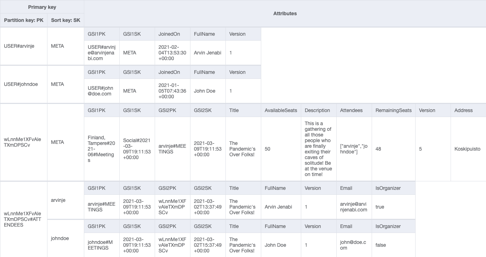
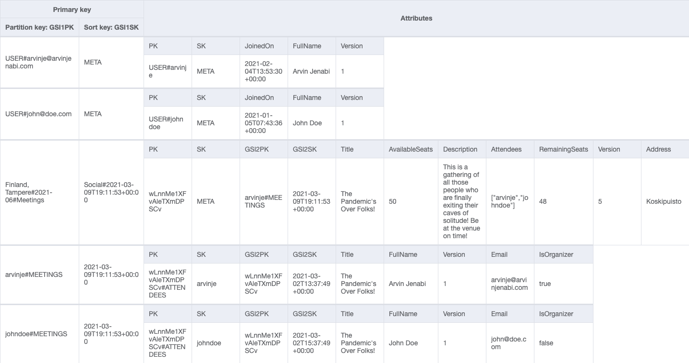
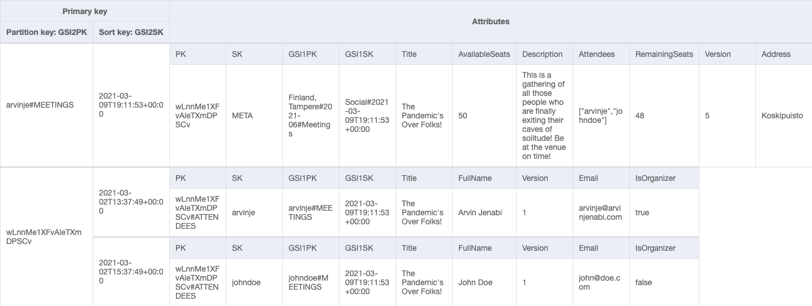

# DynamoDB Table Design

The JSON-formatted data model for the table and the associate GSIs, designed using Amazon NoSQL Workbench, is [available for download.](Meetinger.json)

## Main Table

## Global Secondary Index 1 – GSI1

## Global Secondary Index 2 – GSI2
